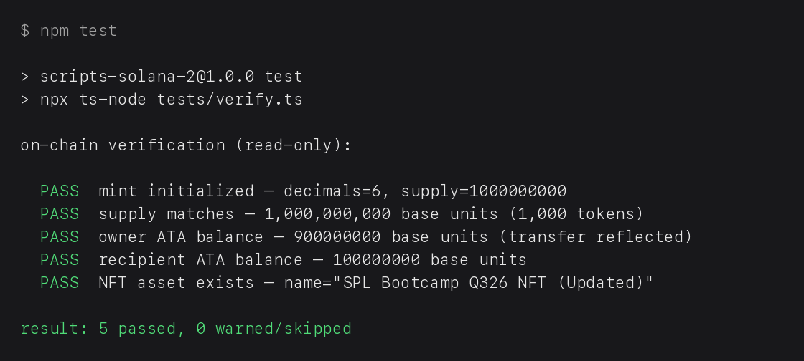

# SPL Token + NFT — Solana Bootcamp Q3-2026 Homework

A complete, homework-ready pipeline for **fungible SPL tokens** and **NFTs via Metaplex Core** on Solana **devnet**, built with [Solana Kit](https://www.solanakit.com/) and [UMI](https://metaplex-foundation.github.io/umi/).

Every write script is **SEND-gated**: it *builds, signs, and dry-runs* by default and only broadcasts when you explicitly opt in with `SEND=1` — so nothing touches the chain by accident.

## Interactive learning lab

Open [`docs/solana-learning-lab.html`](docs/solana-learning-lab.html) directly in a browser, or serve the repository locally:

```bash
python3 -m http.server 8000
# then open http://localhost:8000/docs/solana-learning-lab.html
```

The lab is a self-contained, dependency-free field guide covering:

- Solana accounts, mints, token accounts, ATAs, PDAs, signatures, and CPIs
- The professional model → accounts → logic → LiteSVM → simulation → deployment loop
- Anchor constraints, escrow state machines, vault authority, and failure-path testing
- AMMs, `x · y = k`, liquidity providers, fees, slippage, impermanent loss, and MEV
- A persistent checklist, interactive quizzes, and a 30-day professional learning path

It is designed as an inspectable HTML artifact rather than a static README: use the tabs, try the AMM sliders, answer the authority quiz, and tick off the development workflow.

---

## Overview

| Area | What this repo does |
|---|---|
| **SPL token** | Create a mint (6 decimals) → attach token metadata → mint 1,000 tokens to an ATA → transfer 100 to a second wallet |
| **NFT (MPL Core)** | Upload artwork + JSON metadata to Irys → mint an on-chain Core asset → update the asset as the update-authority |
| **Safety** | `SEND=1` gate on every script; `simulateTransaction` before every broadcast; secrets never printed |
| **Verification** | `npm test` runs a read-only on-chain audit and prints a PASS/WARN table (always exits 0) |

---

## Prerequisites

1. **Node.js** ≥ 20 and `npm`.
2. **A funded devnet wallet** placed at `devnet-wallet.json` in the repo root (JSON array of numbers, e.g. `[174, 23, ...]`). This file is `.gitignore`d — *never* commit or print it.
3. **Devnet SOL** for the authority wallet (rent for mint/ATA/NFT accounts + Irys uploads):
   ```bash
   solana airdrop 2 <YOUR_WALLET_ADDRESS> --url https://api.devnet.solana.com
   ```
4. **A second keypair** to receive the SPL transfer — provided here as `hw-wallet-2.json` (also `.gitignore`d). Public address: `HLnpgWg3zUovnQtVyJbTKUctfavCqt4ZfZTSjc7zM6G5`.
5. **`image.png`** at the repo root (the NFT artwork to upload).

Install dependencies once:

```bash
npm install
```

---

## The SEND gate (read this before running anything)

Each script reads the environment variable `SEND`:

- **unset / `SEND!=1` → DRY RUN.** The transaction is built and signed *locally* and the public "plan" (addresses, amounts, tx size, signature plan) is printed — **nothing is broadcast**. For NFTs, Irys uploads are only *price-probed*, never sent.
- **`SEND=1` → LIVE.** The script first calls `simulateTransaction` (read-only, costs no SOL). If the simulation fails it **aborts without sending**. Only on a clean simulation does it broadcast and confirm.

This is why you can safely run `npm test` or any script with no `SEND` to see the full plan first.

> **Rule of thumb:** always dry-run first. Only add `SEND=1` when you are ready for a real on-chain (or paid Irys) action.

---

## Run order

Execute in this sequence; each step prints the address / URI / signature you must paste into the next script.

### 1. SPL token

```bash
# 1a. Create the mint account (6 decimals, mint authority = wallet)
SEND=1 npm run spl:init
#   → paste the mint address into spl_metadata.ts, spl_mint.ts, spl_transfer.ts

# 1b. Attach on-chain metadata to the mint
SEND=1 npm run spl:metadata

# 1c. Create your ATA and mint 1,000 tokens into it
SEND=1 npm run spl:mint
#   → logs your ATA address + tx signature

# 1d. Transfer 100 whole tokens to the second wallet (idempotent recipient ATA + TransferChecked, decimals 6)
SEND=1 npm run spl:transfer
```

### 2. NFT (Metaplex Core)

```bash
# 2a. Upload the image to Irys and log the image URI
SEND=1 npm run nft:image
#   → paste the image URI into nft_metadata.ts

# 2b. Build + upload the metadata JSON, log the metadata URI
SEND=1 npm run nft:metadata
#   → paste the metadata URI into nft_mint.ts

# 2c. Mint the on-chain asset (fresh keypair = asset address)
SEND=1 npm run nft:mint
#   → logs the asset address; paste it into nft_update.ts

# 2d. Update the asset as update-authority
SEND=1 npm run nft:update
```

### 3. Verify

```bash
npm test
#   → read-only on-chain audit of the mint, ATAs, and NFT; always exits 0
```

---

## Milestones (real devnet transactions)

| Step | Command | Address / Signature | Explorer |
|---|---|---|---|
| Mint created | `spl:init` | mint `8gYR2syTVk1a7mcScpSqo6oVcZRit95KZMQ6VezXL4VM` | [explorer](https://explorer.solana.com/address/8gYR2syTVk1a7mcScpSqo6oVcZRit95KZMQ6VezXL4VM?cluster=devnet) |
| Mint sig | `spl:init` | `4mrafbwMeVAUBaXGoA99mfYKe7riUhQizMNGTbbjfdsMiZ1obVYLD1KdEugy3XbUtdcMqpBc8UB5V51Bdm917vxr` | [explorer](https://explorer.solana.com/tx/4mrafbwMeVAUBaXGoA99mfYKe7riUhQizMNGTbbjfdsMiZ1obVYLD1KdEugy3XbUtdcMqpBc8UB5V51Bdm917vxr?cluster=devnet) |
| Owner ATA funded | `spl:mint` | `ByeFubbcUatkzkSHm3Svgobnjhap4xfXy71aXStvS2SA` | [explorer](https://explorer.solana.com/address/ByeFubbcUatkzkSHm3Svgobnjhap4xfXy71aXStvS2SA?cluster=devnet) |
| Mint sig | `spl:mint` | `4BwtauD4sHqUkPFEQRMXH4hhwz5VNQEW4h3RMSoENx37ZjSHrhjMqUhKXddaDEKkzq1gvxS9dQYCRS2rNHWWuUCn` | [explorer](https://explorer.solana.com/tx/4BwtauD4sHqUkPFEQRMXH4hhwz5VNQEW4h3RMSoENx37ZjSHrhjMqUhKXddaDEKkzq1gvxS9dQYCRS2rNHWWuUCn?cluster=devnet) |
| Recipient wallet | `spl:transfer` (target) | `HLnpgWg3zUovnQtVyJbTKUctfavCqt4ZfZTSjc7zM6G5` | [explorer](https://explorer.solana.com/address/HLnpgWg3zUovnQtVyJbTKUctfavCqt4ZfZTSjc7zM6G5?cluster=devnet) |
| Transfer sig | `spl:transfer` | `3h8zrDoWLEBdy5hzSA8VeNgfog4aX2kH6uvVn6r2fXCPdiHkJAxDgq3zXWPMB3sMGkwj1PiXd14PcTx4cnncGiDj` | [explorer](https://explorer.solana.com/tx/3h8zrDoWLEBdy5hzSA8VeNgfog4aX2kH6uvVn6r2fXCPdiHkJAxDgq3zXWPMB3sMGkwj1PiXd14PcTx4cnncGiDj?cluster=devnet) |
| Image URI | `nft:image` (hosted on catbox — see Irys note below) | `https://files.catbox.moe/5xokag.png` | [open](https://files.catbox.moe/5xokag.png) |
| Metadata URI | `nft:metadata` (hosted on catbox — see Irys note below) | `https://files.catbox.moe/m7446e.json` | [open](https://files.catbox.moe/m7446e.json) |
| NFT asset | `nft:mint` | `9vCufeUJNh6i1wP6bSKPUjCEwCXBBiHbwkra2d2dK6gu` — on-chain name: "SPL Bootcamp Q326 NFT (Updated)" | [explorer](https://explorer.solana.com/address/9vCufeUJNh6i1wP6bSKPUjCEwCXBBiHbwkra2d2dK6gu?cluster=devnet) |
| NFT mint sig | `nft:mint` | `3o942kEgGwbiVxbNyEQWmD7RUV6zbir826Eyx1g6Rg4pScKLBdrJ2LtvyqzfWXMYzymaS8EdXUuVUCXhaNBmGvLv` | [explorer](https://explorer.solana.com/tx/3o942kEgGwbiVxbNyEQWmD7RUV6zbir826Eyx1g6Rg4pScKLBdrJ2LtvyqzfWXMYzymaS8EdXUuVUCXhaNBmGvLv?cluster=devnet) |
| NFT update sig | `nft:update` | `4h1SgH1uTsE7WsgauCbd2383ZJbEAZmUoEds7sJWiYYdHzfxwBYznwgPJjXFJgfxnUFCbixCDy1gHYJgqi5WfhT1` | [explorer](https://explorer.solana.com/tx/4h1SgH1uTsE7WsgauCbd2383ZJbEAZmUoEds7sJWiYYdHzfxwBYznwgPJjXFJgfxnUFCbixCDy1gHYJgqi5WfhT1?cluster=devnet) |

> **Irys offline (documented):** Irys uploads were unavailable from this devnet-funded wallet (`devnet.irys.xyz` fails TLS; the `uploader.irys.xyz` bundler rejects devnet funding with "Confirmed tx not found"), so the artwork and metadata JSON are hosted on `files.catbox.moe` and those URIs are used on-chain. Both halves of the homework — the SPL token pipeline and the MPL Core NFT mint + update — are broadcast and verified on devnet.

---

## Homework task mapping

| # | Task | Script(s) | Status |
|---|---|---|---|
| 1 | SPL transfer (idempotent ATA, TransferChecked, decimals 6) | `src/spl/spl_transfer.ts` | ✅ implemented |
| 2 | NFT via MPL Core (umi + createV1) | `src/nft/nft_image.ts`, `nft_metadata.ts`, `nft_mint.ts` | ✅ minted on devnet |
| 3 | NFT update as update-authority (mpl-core updateV1) | `src/nft/nft_update.ts` | ✅ updated on devnet |
| 4 | (Optional) NFT transfer / burn | `src/nft/nft_transfer.ts`, `nft_burn.ts` | extension |
| 5 | Read-only on-chain verification | `tests/verify.ts` (`npm test`) | ✅ 5/5 PASS |
| 6 | Submission README | `README.md` | ✅ this file |

---

## Resources

- **Class slides / decks** — Google Slides from the bootcamp session.
- **Engineering Solana course** — <https://aseneca.systems/engineering-solana>
- **SPL token basics** — <https://solana.com/docs/tokens/basics>
- **Solana Kit docs** — <https://www.solanakit.com/>
- **Metaplex Core (NFT)** — <https://www.metaplex.com/docs/smart-contracts/core>
- **Reference / class repo** — <https://github.com/ToXMon/solana-bootcamp.git>
- **Metaplex Token Metadata** — <https://www.metaplex.com/docs/smart-contracts/token-metadata>

---

## Screenshots



---

## Layout

```
src/spl/
  spl_init.ts      create mint account
  spl_metadata.ts  attach metadata to mint
  spl_mint.ts      create ATA + mint tokens
  spl_transfer.ts  TransferChecked to second wallet
src/nft/
  nft_image.ts     upload image.png to Irys
  nft_metadata.ts  upload metadata JSON to Irys
  nft_mint.ts      createV1 Core asset
  nft_update.ts    updateV1 asset (update authority)
tests/
  verify.ts        read-only on-chain audit (npm test)
```